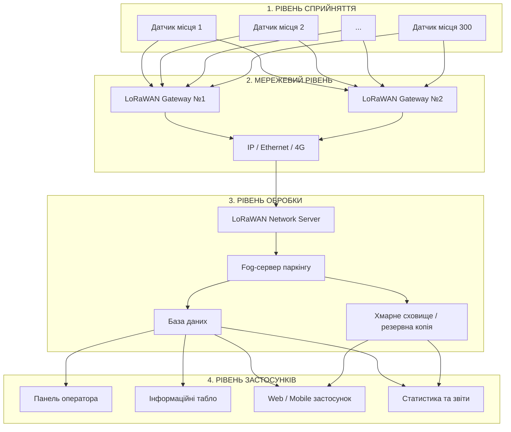

# Розумне паркування — система визначення зайнятості міського паркінгу

## 1. Опис

### Мета

Спроєктувати IoT-систему контролю зайнятості міського паркінгу на **300 паркувальних місць**.
Система повинна автоматично визначати, чи зайняте кожне паркувальне місце, передавати інформацію через бездротову мережу, обробляти отримані дані та надавати користувачам актуальну інформацію про вільні місця.

### Основні функції системи

1. Визначення стану кожного паркувального місця.
2. Передача даних від датчиків до шлюзів.
3. Централізована обробка інформації.
4. Відображення кількості та розташування вільних місць.
5. Збереження історії зайнятості.
6. Формування статистики використання паркінгу.
7. Виявлення несправностей датчиків або втрати зв'язку.

# 2. Загальна архітектура

Для проєктування використовується чотирирівнева IoT-модель:
1. **Рівень сприйняття (Perception)** — датчики зайнятості.
2. **Мережевий рівень (Network)** — LoRaWAN та шлюзи.
3. **Рівень обробки (Processing)** — локальний fog-сервер та хмарне сховище.
4. **Рівень застосунків (Application)** — інформаційна панель оператора, табло та мобільний/web-інтерфейс.
LoRaWAN використовує топологію **Star-of-Stars**: кінцеві пристрої не формують mesh-мережу між собою, а передають повідомлення одному або декільком шлюзам, які пересилають їх до Network Server.

## Архітектурна діаграма



### Принцип роботи

Датчик на кожному паркувальному місці визначає наявність автомобіля та передає стан через LoRaWAN.
Повідомлення може містити:
* ідентифікатор датчика;
* ідентифікатор паркувального місця;
* стан `FREE/OCCUPIED`;
* рівень заряду батареї;
* час вимірювання;
* технічний стан пристрою.
Шлюзи приймають LoRaWAN-повідомлення та передають їх IP-мережею до Network Server.
Після цього інформація потрапляє на локальний fog-сервер, де визначається актуальний стан усіх 300 місць.

# 3. Склад системи

| Пристрій / компонент    | Що вимірює або робить                            | Де розміщено                               |
| ----------------------- | ------------------------------------------------ | ------------------------------------------ |
| 300 датчиків зайнятості | Визначають наявність автомобіля                  | По одному на кожному паркувальному місці   |
| LoRaWAN Gateway №1      | Приймає дані від датчиків                        | Висока опора/щогла на одному боці паркінгу |
| LoRaWAN Gateway №2      | Приймає дані та забезпечує резервування          | Висока опора/щогла на протилежному боці    |
| LoRaWAN Network Server  | Керує пристроями, шлюзами та повідомленнями      | Fog-сервер                                 |
| Fog-сервер              | Обробляє дані та формує актуальний стан паркінгу | Технічне приміщення паркінгу               |
| База даних              | Зберігає поточний та історичний стан місць       | На fog-сервері                             |
| Хмарне сховище          | Резервне збереження та довгострокова статистика  | Хмарна інфраструктура                      |
| Інформаційне табло      | Показує кількість вільних місць                  | На в'їзді до паркінгу                      |
| Web/Mobile інтерфейс    | Показує користувачеві вільні місця               | Смартфон / браузер                         |
| Панель оператора        | Моніторинг стану паркінгу та обладнання          | Робоче місце адміністратора                |

# 4. Вибір способу визначення зайнятості

Для системи розглянуто два основних варіанти:
1. ультразвуковий датчик;
2. геомагнітний датчик.
Обидві технології використовуються у системах Smart Parking. Дослідження технологій визначення зайнятості паркомісць розглядають, зокрема, ультразвукові датчики та магнітометри як поширені способи виявлення автомобіля.

## 4.1. Варіант 1 - ультразвуковий датчик
Ультразвуковий датчик визначає відстань до об'єкта за часом проходження та повернення ультразвукової хвилі.
При наявності автомобіля відстань між датчиком та об'єктом змінюється, тому система визначає місце як зайняте.
Наприклад, LoRaWAN distance sensors Dragino підтримують ультразвукове вимірювання та прямо передбачають використання для parking management.

### Переваги

* простий принцип роботи;
* безконтактне вимірювання;
* можна отримувати не лише стан, а й відстань;
* невисока вартість;
* можливість роботи через LoRaWAN.

### Недоліки

Основним недоліком для відкритого міського паркінгу є залежність від навколишнього середовища.
Дослідження Smart Parking показують, що ультразвукові датчики добре підходять для закритих паркінгів, але дощ, сніг та інші погодні фактори можуть погіршувати результати вимірювання.

# 5. Варіант 2 — геомагнітний датчик

Геомагнітний датчик визначає зміну магнітного поля, яка виникає при появі металевого об'єкта — автомобіля — над датчиком.
Такий датчик можна встановити безпосередньо в центрі паркувального місця.
Геомагнітні датчики широко використовуються для систем Smart Parking через низьке енергоспоживання та можливість встановлення безпосередньо на паркувальному місці.

### Переваги

* низьке енергоспоживання;
* не потребує прямої видимості автомобіля;
* компактний розмір;
* добре підходить для зовнішніх паркінгів;
* може працювати від батареї протягом тривалого часу;
* невеликий обсяг переданих даних.

### Недоліки

* можливий вплив сусідніх автомобілів;
* характеристики можуть залежати від типу автомобіля;
* необхідне правильне розташування датчика;
* можливі помилки через складне паркування.
Дослідження магнітних систем показують, що на результат можуть впливати сусідні автомобілі та «мертві зони» магнітного сигналу, особливо для автомобілів із високим кліренсом.

# 6. Порівняння датчиків

| Критерій                          | Ультразвуковий                            | Геомагнітний             |
| --------------------------------- | ----------------------------------------- | ------------------------ |
| Принцип                           | Вимірювання відстані                      | Зміна магнітного поля    |
| Монтаж                            | Над місцем або на спеціальній конструкції | Безпосередньо на/у місці |
| Залежність від погоди             | Вища                                      | Нижча                    |
| Енергоспоживання                  | Низьке                                    | Дуже низьке              |
| Підходить для відкритого паркінгу | Середньо                                  | Добре                    |
| Ризик впливу сусідніх автомобілів | Низький/середній                          | Середній                 |
| Вартість                          | Низька/середня                            | Низька/середня           |
| Технічне обслуговування           | Середнє                                   | Низьке                   |
| Рекомендація для проєкту          | Резервний варіант                         | **Основний варіант**     |

## Вибір

Для міського паркінгу на 300 місць обирається **геомагнітний LoRaWAN-датчик**.
Причина вибору - датчик безпосередньо встановлюється на паркувальному місці, має низьке енергоспоживання та не потребує конструкції над кожним місцем.
Як приклад комерційного рішення можна розглядати LoRaWAN parking sensor HKT MPS-100 із геомагнітним та радарним визначенням зайнятості. На момент підготовки документа його ціна становить близько **170 € без податків** за одиницю.
Також на ринку присутні дешевші рішення: наприклад, HKT LoRaWAN parking sensor із геомагнітним та 24 GHz radar detection має оптову ціну близько **63 € за одиницю при замовленні від 101 шт.**
Для економічної оцінки проєкту використовується саме оптова ціна.

# 7. Вибір мережевої технології

## LoRaWAN

Для передачі даних від 300 датчиків обирається **LoRaWAN**.
LoRaWAN є LPWAN-протоколом, орієнтованим на підключення великої кількості енергоефективних пристроїв. Стандарт використовує топологію **Star-of-Stars**, у якій кінцеві пристрої передають дані до одного або декількох шлюзів.

### Чому не Wi-Fi?

Wi-Fi потребує значно більшого енергоспоживання та створює необхідність забезпечити інфраструктуру Wi-Fi у всій зоні паркінгу.
Для батарейних датчиків, які передають невеликий обсяг інформації, це недоцільно.

### Чому не Bluetooth?

Bluetooth має меншу типову дальність і не є оптимальним для централізованого підключення 300 стаціонарних датчиків до одного серверного вузла.

### Чому не NB-IoT?

NB-IoT може бути технічно придатним, але для 300 датчиків кожен пристрій потребував би стільникового підключення та відповідної SIM/eSIM-інфраструктури.
LoRaWAN дозволяє використовувати приватну мережу з власними шлюзами.

# 8. Топологія мережі

Обрана топологія:
**Star-of-Stars**

```text
              Датчики
           /    |    \
          /     |     \
        LoRaWAN LoRaWAN LoRaWAN
          \      |      /
           \     |     /
        Gateway №1    Gateway №2
             \        /
              \      /
             IP Network
                 |
          Network Server
                 |
            Fog-сервер
```

Перевага такої архітектури полягає в тому, що датчики не повинні безпосередньо знати, до якого шлюзу вони підключені.
Повідомлення може бути прийняте декількома шлюзами, після чого Network Server виконує дедуплікацію отриманих копій.

# 9. Розрахунок кількості шлюзів

Кількість шлюзів визначається двома факторами:
1. пропускною здатністю;
2. радіопокриттям та резервуванням.

## 9.1. Перевірка пропускної здатності

Для прикладу розглянемо gateway Milesight UG67.
Виробник вказує:
* 8 LoRaWAN-каналів;
* до 2000 кінцевих пристроїв;
* до 2 км типового міського покриття;
* IP67;
* Ethernet та 4G;
* підтримку EU868.

Для 300 датчиків:
$$
N_{capacity} = \left\lceil \frac{300}{2000} \right\rceil = 1
$$
Отже, **за кількістю пристроїв достатньо одного шлюзу**.
Однак один шлюз створює єдину точку відмови.

# 10. Чому обрано два шлюзи

Для реального міського паркінгу використовується **2 шлюзи**.
Другий шлюз потрібний не через кількість 300 датчиків, а для:
* резервування;
* перекриття радіозон;
* зменшення ризику втрати зв'язку;
* роботи системи при виході одного шлюзу з ладу;
* компенсації затінення сигналу автомобілями, металевими конструкціями та іншими перешкодами.
Виробник UG67 вказує до 2 км покриття в міських умовах, тому територія паркінгу значно менша за максимальну дальність одного шлюзу.

# 11. Розміщення шлюзів

Приймемо для проєкту умовний паркінг розміром:
**120 × 80 м = 9600 м²**
Шлюзи встановлюються на висоті приблизно 6–8 м.

```text
                  120 м
       ┌────────────────────────────┐
       │                            │
       │  G1 ●                      │
       │                            │
       │       ┌────────────┐       │
       │       │ Паркінг    │       │
       │       │ 300 місць  │       │
       │       └────────────┘       │
       │                            │
       │                      ● G2  │
       │                            │
       └────────────────────────────┘
                  80 м
```

### Принцип розміщення

Gateway №1 розташовується біля одного краю паркінгу, Gateway №2 — біля протилежного.
Таким чином:
* більшість датчиків мають зв'язок із двома шлюзами;
* при відмові одного шлюзу датчики продовжують передавати дані через другий;
* формується зона перекриття;
* зменшується вплив локальних радіоперешкод.
**Висновок:** для 300 місць оптимально встановити **2 LoRaWAN outdoor gateways**.

# 12. Оцінка трафіку

Кожен датчик не повинен постійно передавати дані.
Пропонується така схема:
* повідомлення при зміні стану `FREE → OCCUPIED`;
* повідомлення при зміні стану `OCCUPIED → FREE`;
* періодичний heartbeat кожні 5 хвилин;
* передача рівня батареї раз на кілька годин.

Для 300 датчиків при heartbeat раз на 5 хвилин:
$$
300 \times 12 = 3600
$$
повідомлень на годину.
Це приблизно:
$$
\frac{3600}{3600}=1
$$
повідомлення в середньому за секунду для всієї системи.
Фактичне навантаження буде ще нижчим, оскільки події зміни стану не відбуваються одночасно для всіх місць.
Для EU868 також необхідно враховувати обмеження duty cycle радіопередачі; LoRaWAN визначає відповідні обмеження для каналів та піддіапазонів.

# 13. Розміщення обробки даних

## Обраний підхід — Fog Computing

Основна оперативна обробка виконується на **fog-рівні**, тобто на локальному сервері паркінгу.
Схема:

```text
Датчик
   ↓
LoRaWAN Gateway
   ↓
Network Server
   ↓
Fog-сервер
   ↓
Поточний стан паркінгу
   ↓
Табло / Web / Mobile
```

Хмара використовується для:
* резервного копіювання;
* довгострокового зберігання;
* статистики;
* віддаленого доступу адміністратора.

# 14. Вимога до затримки

Для системи встановлюється вимога:
> **Статус паркувального місця повинен відображатися користувачеві не пізніше ніж через 3 секунди після зміни стану.**

Наприклад:
```text
Автомобіль заїхав
      ↓
Датчик визначив автомобіль
      ↓
LoRaWAN
      ↓
Gateway
      ↓
Fog-сервер
      ↓
Оновлення бази
      ↓
Табло / Web
```
Ця вимога не є вимогою жорсткого реального часу, але користувач повинен отримувати практично актуальну інформацію.

## Чому не тільки хмара?

Якби обробка виконувалася виключно в хмарі, шлях даних був би:

```text
датчик → gateway → Internet → cloud → application
```

Це додає залежність від:
* якості Internet-з'єднання;
* доступності хмарного сервісу;
* затримок WAN;
* можливих проблем із зовнішньою мережею.
Fog-сервер дозволяє виконувати критичну для роботи паркінгу обробку локально.

Тому:
**Fog = оперативний стан**
**Cloud = історія, резервування та аналітика**

# 15. Програмна частина без програмування

У межах проєкту програмування не виконується.
На рівні архітектури передбачається:
* LoRaWAN Network Server;
* база даних;
* сервіс обробки станів;
* Web/Mobile інтерфейс;
* панель адміністратора.
Як приклад готового програмного компонента можна використати **ChirpStack** — open-source LoRaWAN Network Server, який підтримує керування шлюзами та пристроями, інтеграцію з базами даних та зовнішніми сервісами.

# 16. Безпека

## Загроза 1 — підробка датчика

### Загроза

Зловмисник може спробувати додати до мережі власний пристрій або видавати себе за легітимний датчик.
Це може призвести до передачі неправильного статусу паркувального місця.

### Захід протидії

Використовувати **OTAA** для підключення пристроїв та унікальні криптографічні ключі для кожного датчика.
LoRaWAN використовує AES-128 та механізми автентифікації пристроїв. OTAA рекомендується як більш безпечний спосіб активації порівняно з ABP.

## Загроза 2 — перехоплення інформації

### Загроза

Зловмисник може перехоплювати радіоповідомлення між датчиками та шлюзами.

### Захід протидії

Використовувати вбудовані механізми LoRaWAN:
* AES-128;
* Network Session Key;
* Application Session Key;
* контроль цілісності повідомлень.
LoRaWAN передбачає окремий рівень мережевої безпеки та шифрування прикладних даних між кінцевим пристроєм і Application Server.

## Загроза 3 — глушіння радіоканалу

### Загроза

Зловмисник може створювати радіоперешкоди, через які датчики не зможуть передавати інформацію.

### Захід протидії

Використати:
* два шлюзи;
* перекриття зон покриття;
* контроль втрати пакетів;
* моніторинг RSSI/SNR;
* сигналізацію про відсутність heartbeat від датчика.
У разі втрати одного шлюзу інший шлюз продовжує приймати повідомлення від пристроїв.

## Загроза 4 — фізичне пошкодження або викрадення датчика

### Загроза

Датчик на паркувальному місці знаходиться у відкритому середовищі та може бути пошкоджений автомобілем, навмисно демонтований або викрадений.

### Захід протидії

Передбачити:
* IP67/IP68 корпус;
* механічне кріплення;
* контроль рівня батареї;
* heartbeat;
* повідомлення про втрату зв'язку;
* регулярну перевірку стану обладнання.

# 17. Вартість розгортання

Розрахунок є **оцінкою порядку величини**, а не комерційною пропозицією.
Для розрахунку використано оптову ціну LoRaWAN parking sensor близько **63,05 € за одиницю** при замовленні від 101 шт.
Для шлюзу використовується орієнтир **800 €** за outdoor Milesight UG67 із 8 LoRaWAN-каналами та 4G.

## 17.1. Датчики

$$
300 \times 63.05 = 18\,915\ €
$$
Отже:
**≈ 18 900 €**

## 17.2. LoRaWAN gateways

Необхідно:
**2 × 800 € = 1 600 €**

## 17.3. Fog-сервер

Як бюджетний орієнтир можна використати Raspberry Pi 5.
Офіційна ціна Raspberry Pi 5 8 GB зараз становить близько **$95 за плату**, без урахування додаткового накопичувача, блока живлення та корпусу.
Для реального промислового розгортання необхідно врахувати SSD, блок живлення, корпус, резервне живлення та монтаж.
Приймемо оцінку:
**≈ 300 €**

## 17.4. Монтаж та інфраструктура

Необхідно передбачити:
* кріплення датчиків;
* монтаж двох шлюзів;
* антени та кабелі;
* захист електроживлення;
* мережеве обладнання;
* налаштування;
* резервне живлення;
* маркування місць.
Для попереднього проєктного розрахунку приймемо **25% від вартості основного обладнання** як резерв на монтаж та інфраструктуру.
Основне обладнання:
$$
18\,915 + 1\,600 + 300 = 20\,815\ €
$$
Резерв:
$$
20\,815 \times 0.25 = 5\,204\ €
$$
Загальна оцінка:
$$
20\,815 + 5\,204 = 26\,019\ €
$$
Отже, порядок вартості розгортання:
> **≈ 26 000 €**
або приблизно **25–30 тис. €** для базового варіанту без вартості будівельних робіт, мобільного/хмарного тарифу та подальшого обслуговування.

# 18. Підсумкова таблиця вартості

| Компонент                | Кількість | Орієнтовна ціна |          Сума |
| ------------------------ | --------: | --------------: | ------------: |
| LoRaWAN parking sensor   |       300 |         63,05 € |      18 915 € |
| Outdoor LoRaWAN Gateway  |         2 |           800 € |       1 600 € |
| Fog-сервер               |         1 |          ≈300 € |        ≈300 € |
| Монтаж та інфраструктура |         — |            ≈25% |      ≈5 200 € |
| **Разом**                |           |                 | **≈26 000 €** |

> Ціни є орієнтовними та залежать від постачальника, кількості замовлення, доставки, податків і комплектації.

# 19. Експлуатація системи

Після розгортання система повинна контролювати:
* доступність кожного датчика;
* рівень заряду батарей;
* кількість вільних місць;
* кількість зайнятих місць;
* якість LoRaWAN-зв'язку;
* стан шлюзів;
* наявність Internet/backhaul;
* помилки Network Server.
Для кожного датчика необхідно встановити heartbeat.
Якщо протягом заданого часу повідомлення від датчика не надходять, система повинна позначити його як потенційно несправний.

# 20. Очікуваний результат

Запропонована система дозволяє автоматично контролювати **300 паркувальних місць** та надавати користувачам актуальну інформацію про їх зайнятість.
Основні рішення:

| Параметр              | Обране рішення              |
| --------------------- | --------------------------- |
| Кількість місць       | 300                         |
| Основний датчик       | Геомагнітний LoRaWAN        |
| Альтернативний датчик | Ультразвуковий              |
| Мережева технологія   | LoRaWAN                     |
| Топологія             | Star-of-Stars               |
| Кількість шлюзів      | **2**                       |
| Розміщення шлюзів     | Протилежні сторони паркінгу |
| Основна обробка       | **Fog**                     |
| Хмарне використання   | Історія та аналітика        |
| Цільова затримка      | **≤ 3 с**                   |
| Кількість датчиків    | 300                         |
| Орієнтовна вартість   | **≈ 25–30 тис. €**          |

# 21. Висновок

Для міського паркінгу на 300 місць доцільно використати LoRaWAN-мережу з 300 батарейними датчиками зайнятості та двома outdoor-шлюзами.
Основним способом визначення зайнятості обрано геомагнітний датчик, оскільки він компактний, має низьке енергоспоживання та може бути встановлений безпосередньо на паркувальному місці. Ультразвуковий варіант залишається альтернативою, але є більш чутливим до погодних умов, що важливо для відкритого міського паркінгу.
LoRaWAN обрано через підтримку великої кількості енергоефективних пристроїв, велику дальність та топологію Star-of-Stars. Один шлюз за кількістю вузлів технічно достатній, однак використання двох шлюзів забезпечує резервування та підвищує надійність системи. Конкретний outdoor-шлюз UG67 заявляє підтримку понад 2000 вузлів та до 2 км покриття в міських умовах.
Оперативну обробку запропоновано виконувати на fog-рівні. Це дозволяє виконати вимогу щодо оновлення статусу паркувального місця не пізніше ніж через 3 секунди та зменшує залежність основної функціональності від Internet-з'єднання.
Орієнтовна вартість розгортання системи становить **25–30 тис. €**, що відповідає порядку величини для системи на 300 паркувальних місць.

# 22. Джерела

1. **LoRa Alliance — LoRaWAN Specification / Architecture.**
   Опис архітектури Star-of-Stars, принципів роботи LoRaWAN та безпеки.
2. **The Things Network — LoRaWAN Architecture.**
   Опис кінцевих пристроїв, шлюзів, Network Server та Application Server.
3. **The Things Network — Security.**
   Опис AES-128, session keys, MIC та захисту LoRaWAN.
4. **The Things Network — Certified Security.**
   Опис OTAA та механізмів автентифікації пристроїв.
5. **Milesight — UG67 Outdoor LoRaWAN Gateway.**
   Технічні характеристики шлюзу, 8 каналів, до 2000+ вузлів, міське покриття до 2 км.
6. **Dragino — DDS45-LB / DDS45-LS.**
   Приклад LoRaWAN ультразвукового distance sensor із застосуванням для parking management.
7. **HKT MPS-100 LoRaWAN Parking Sensor.**
   Приклад комерційного геомагнітного/radar parking sensor та ціна.
8. **Smart Parking Sensors: State of the Art and Performance Evaluation.**
   Наукове порівняння технологій визначення зайнятості паркомісць.
9. **An Improved Roadside Parking Space Occupancy Detection Method Based on Magnetic Sensors.**
   Дослідження точності та обмежень магнітних датчиків.
10. **ChirpStack — Open-source LoRaWAN Network Server.**
    Приклад програмного компонента для приватної LoRaWAN-мережі.
11. **Raspberry Pi — Raspberry Pi 5.**
    Орієнтир вартості fog-комп'ютера.
